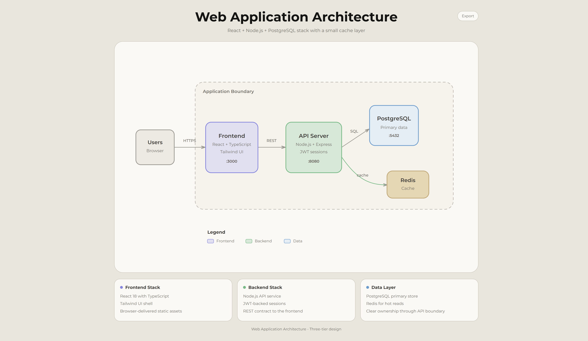
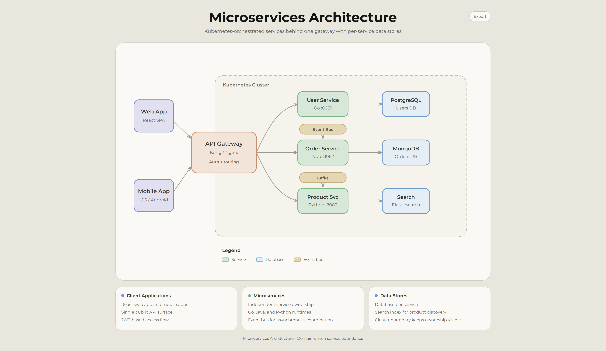

# Cloudy Tech Diagrams Skill

[简体中文](README.md) | English

Cloudy Tech Diagrams Skill is a general technical diagram drawing skill for AI agents. It gives Claude Code, Codex, Claude.ai, Cursor, and similar agent runtimes a stable set of diagram expression rules, an HTML + SVG template, export capabilities, and a verification checklist, so they can generate browser-ready technical diagrams from text descriptions, codebase analysis, or documentation.

It uses a warm Claude-style visual direction that can fit quickly into common documents.

## What Problem It Solves

- You do not need to repeatedly explain diagram style, output format, export behavior, and quality checks every time you ask an agent to draw an architecture diagram
- Agent-generated diagrams often look like drafts: unclear arrow endpoints, overflowing text, confused node hierarchy, and unstable exports
- Mermaid / Graphviz are good for quickly expressing structure, but they are less flexible for visual control, document embedding, and fine layout
- Technical docs, solution reviews, and technical talks need a diagram that can be opened, exported, and manually adjusted as drawio, PNG, or PDF
- It provides a visual design aligned with the Claude website, with a unified visual style and quality baseline

## Suitable For

- Software architecture diagrams
- System design diagrams
- Process flows and runtime mechanics
- Cloud architecture and deployment views
- Security boundaries and identity authentication paths
- Network topology diagrams
- Data flow and event flow diagrams
- Explanatory diagrams for technical documentation or technical talks

It is not positioned as a general poster, brand visual, landing page, dashboard, non-technical illustration, or ordinary slide deck tool.

## Quick Start

Quick start has two steps: install the Skill somewhere the agent can read it, then call it in the prompt.

### Install

Installation has two layers: first choose an acquisition channel, then choose an install location.

#### Choose Acquisition Channel

**Release package**: recommended for formal use, team distribution, and release verification.

Download the latest Release package from GitHub Releases:

```text
cloudy-tech-diagrams-skill-vX.Y.Z.zip
```

The Release zip contains one top-level Skill directory:

```text
cloudy-tech-diagrams/
├── SKILL.md
├── LICENSE
├── VERSION
├── assets/
└── references/
```

**Source clone**: suitable for local development, debugging, contribution, or quick trial before a Release package exists.

Source repository URL:

```text
https://github.com/cloudy-liu/cloudy-tech-diagrams-skill.git
```

The repository root itself is the Skill Root. As long as the agent can read `SKILL.md`, `assets/`, and `references/`, it can use the Skill. Source installation does not automatically generate a `VERSION` file; for stable team distribution or release verification, prefer the zip generated by GitHub Release.

#### Choose Install Location

**Codex / Agents**

Global install, using the Release package:

```bash
unzip cloudy-tech-diagrams-skill-vX.Y.Z.zip -d ~/.agents/skills/
```

Global install, using source clone:

```bash
mkdir -p ~/.agents/skills
git clone https://github.com/cloudy-liu/cloudy-tech-diagrams-skill.git ~/.agents/skills/cloudy-tech-diagrams
```

The global install path is usually:

```text
~/.agents/skills/cloudy-tech-diagrams/
```

Project-local install, using the Release package:

```bash
mkdir -p .agents/skills
unzip cloudy-tech-diagrams-skill-vX.Y.Z.zip -d .agents/skills/
```

Project-local install, using source clone:

```bash
mkdir -p .agents/skills
git clone https://github.com/cloudy-liu/cloudy-tech-diagrams-skill.git .agents/skills/cloudy-tech-diagrams
```

**Claude Code**

Global install, using the Release package:

```bash
unzip cloudy-tech-diagrams-skill-vX.Y.Z.zip -d ~/.claude/skills/
```

Global install, using source clone:

```bash
mkdir -p ~/.claude/skills
git clone https://github.com/cloudy-liu/cloudy-tech-diagrams-skill.git ~/.claude/skills/cloudy-tech-diagrams
```

The global install path is usually:

```text
~/.claude/skills/cloudy-tech-diagrams/
```

Project-local install, using the Release package:

```bash
mkdir -p .claude/skills
unzip cloudy-tech-diagrams-skill-vX.Y.Z.zip -d .claude/skills/
```

Project-local install, using source clone:

```bash
mkdir -p .claude/skills
git clone https://github.com/cloudy-liu/cloudy-tech-diagrams-skill.git .claude/skills/cloudy-tech-diagrams
```

**Claude.ai**

If your Claude.ai workspace supports custom Skill uploads, upload the Release zip directly. Skill availability and upload locations can differ by account and organization, so use the current Claude.ai interface as the source of truth.

**Cursor / Windsurf / Other Agents**

Most of these tools already support standard layouts such as `.agents/skills`, so they can usually reuse the Codex / Agents Skill configuration above.

### Use

Give the agent a system description and explicitly ask it to use this Skill:

```text
Use cloudy-tech-diagrams to generate a technical architecture diagram for the following system:

- React web app and mobile clients
- API Gateway
- User Service, Order Service, Product Service
- PostgreSQL, Redis, Elasticsearch
- Kafka event flow
- Kubernetes deployment
```

You can also ask the agent to analyze a codebase first, then generate a diagram:

```text
Analyze this codebase and summarize its architecture, then use cloudy-tech-diagrams to generate a technical architecture diagram.
```

If you want the diagram to follow a document or an existing architecture diagram more closely, provide the link, screenshot, or original description together with the task:

```text
Read this documentation, identify its core project architecture, then use cloudy-tech-diagrams to generate a browser-ready HTML architecture diagram. Focus the diagram on project architecture, not overly detailed implementation details.
```

The generated result is usually a `.html` file. Open it directly in a browser, then use the Copy / PNG / PDF buttons at the top of the page to export it.

## What The Output Is

Each diagram is a self-contained HTML file by default:

- Embedded CSS.
- Inline SVG graphics.
- No external images.
- CDN JavaScript only for export.
- Copy / PNG / PDF export toolbar kept by default.
- Opens directly in modern browsers.
- Suitable for continued use in technical docs, solution review materials, README files, issues, or talk drafts.

## Examples

### Perfetto Project Architecture


### Web Application Architecture



### Microservices Architecture



## Design And Quality Principles

The goal of this Skill is not to make diagrams complicated, but to make them reliably readable in technical documentation.

- Use a warm paper background instead of a dark dashboard style.
- Use restrained semantic colors for component types such as frontend, backend, data, cloud, security, and event.
- Use open chevron arrows, avoiding heavy triangular arrowheads.
- Use HTML + SVG so agents can directly control layout, text, lines, and export.
- Check diagram expression before and after generation: text does not overflow, arrowheads are visible, connectors have clear sources and targets, and legends do not sit inside boundary boxes.
- The general checklist constrains diagram expression quality only; it does not decide whether a specific domain model is correct.

## Repository Layout

```text
cloudy-tech-diagrams-skill/
├── SKILL.md
├── assets/
│   └── template.html
├── references/
│   ├── style-references.md
│   └── images/
├── examples/
│   ├── web-app.html
│   ├── microservices.html
│   ├── perfetto-docs-architecture.html
│   └── images/
├── README.md
├── README.en.md
└── LICENSE
```

`SKILL.md` is the core instruction file read by the agent. `assets/template.html` is the starting point the agent copies and customizes when creating diagrams. `references/` stores style reference material. `examples/` contains sample outputs for GitHub README and maintenance; it is not part of the minimal Release package.

## Credits

- Cloudy Tech Diagrams Skill is inspired by [Cocoon-AI/architecture-diagram-generator](https://github.com/Cocoon-AI/architecture-diagram-generator). It extends and customizes that project. Thanks.

## License

MIT License. See [LICENSE](LICENSE).
