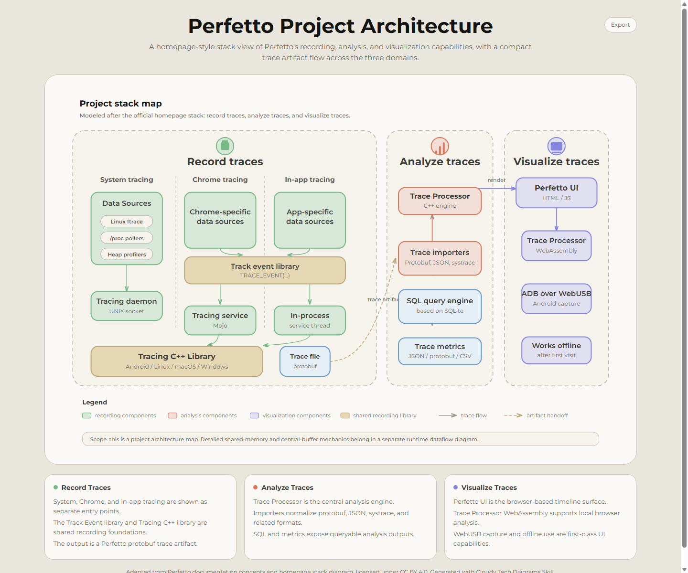
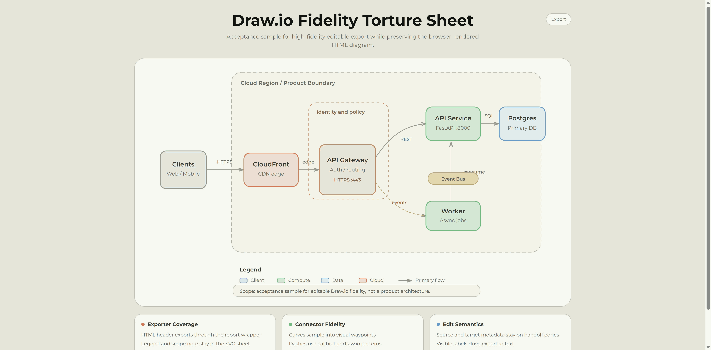

# Cloudy Tech Diagrams Skill

[English](README.en.md) | 简体中文

# 解决什么问题

现在绘制架构图完全不需要自己动手了吧？这个 skill 可以帮你快速绘制出 类似 claude 风格暖色架构图（claude 官方博客配图的风格），暖色、清晰。

绘图的 skill ，也非常多，但是，**你真正用的时候，会发现，改图特别麻烦**，这个 skill 绘制出来的图，可以**高保真的导出 drawio 格式的图**（因为我个人用的最多就是 drawio) ，这样，当你的 Agent 在细节上达不到你的要求时，你可以在自己导出 drawio 图，快速做局部微调！

## 示例

### 微服务架构

<p align="center">
  
</p>

### Perfetto 项目架构

<p align="center">
  
</p>

### Draw.io 导出演示

当你想手动修改一些细节或者想转为 `drawio` 文件本地修改时，可以通过一键导出 `download drawio`功能，直接导出drawio 的文件，继续在 diagrams.net / draw.io 中手工调整。随时掌控细节！

<p align="center">
  
</p>

## Draw.io Export Fidelity

Draw.io Export Fidelity 是这个 skill 的核心产品契约。它保持 HTML-first：浏览器里的 HTML 图仍然是第一体验，`.drawio` 文件是用于本地细修的高保真可编辑延续路径。目标是 editable visual equivalence，也就是尽量用 draw.io 原生可编辑形状保持视觉等价，而不是把整页 HTML/CSS 任意转换、整页 DOM 转换、单张图片导出或栅格化。

default Draw.io export 是 controlled report export：page header plus exportable SVG sheet，并且排除 toolbar、footer、page-support cards。HTML page header 是必需边界，visible HTML `<h1>` and subtitle 会和 exportable diagram sheet 一起进入导出结果。只有当 SVG sheet 脱离页面后仍需要独立上下文时，才添加 sheet-owned title or caption，并且不能重复页面标题或副标题。

exportable diagram sheet 包含用户后续真正要编辑的图内容：节点、边界、连接线、标签、diagram legend、scope note，以及有实际含义的 summary 内容。不要放 fixed template summary badge。page chrome、toolbar 和无关 footer 元数据不进入 Draw.io 文件。

## 快速开始

快速开始分两步：先把 Skill 安装到 agent 能读取的位置，再在提示词里调用它。

### 安装

将以下 GitHub 地址直接提供给你的 Agent（Claude Code、Codex、Cursor 等），它会自动帮你安装好：

```text
https://github.com/cloudy-liu/cloudy-tech-diagrams-skill.git
```

Agent 会根据运行环境自动选择合适的安装位置（全局或项目本地）。

### 使用

给 agent 一段系统描述，并明确要求使用这个 Skill：

```text
使用 cloudy-tech-diagrams 为下面系统生成一张技术架构图：

- React Web 应用和移动端客户端
- API Gateway
- User Service、Order Service、Product Service
- PostgreSQL、Redis、Elasticsearch
- Kafka 事件流
- Kubernetes 部署
```

也可以让 agent 先分析代码库，再生成图：

```text
先分析这个代码库并总结它的架构，然后使用 cloudy-tech-diagrams 生成一张技术架构图。
```

如果你希望图更贴近某份文档或已有架构图，可以把链接、截图或原始描述一起给 agent：

```text
阅读这份文档，识别它的核心项目架构，然后使用 cloudy-tech-diagrams 生成一份可在浏览器打开的 HTML 架构图。图的重点放在项目架构，不要展开到过细的实现细节。
```

生成结果通常是一份 `.html` 文件。直接用浏览器打开即可查看，并可使用 Export 菜单动作导出：Copy Image / Download PNG / Download PDF / Download Draw.io。

## 仓库结构

```text
cloudy-tech-diagrams-skill/
├── SKILL.md
├── assets/
│   └── template.html
├── references/
│   ├── style-references.md
│   └── images/
├── examples/
│   ├── web-app.html
│   ├── microservices.html
│   ├── perfetto-docs-architecture.html
│   └── images/
├── README.md
├── README.en.md
└── LICENSE
```

`SKILL.md` 是 agent 读取的核心指令。`assets/template.html` 是生成图表时复制和改写的起点。`references/` 保存风格参考资料。`examples/` 是 GitHub README 和维护用的示例输出，不会进入最小 Release 包。

## 致谢

* Cloudy-Tech-Diagrams-skill 的灵感来源于 [Cocoon-AI/architecture-diagram-generator](https://github.com/Cocoon-AI/architecture-diagram-generator) 项目，它是一个暗色模式的图风格，本 skill 对它做了优化、客制化。

## 许可证

MIT License。详见 [LICENSE](LICENSE)。

欢迎提 Issue 或直接发 PR。感谢 [Linux.do](https://linux.do/) 社区推动。
